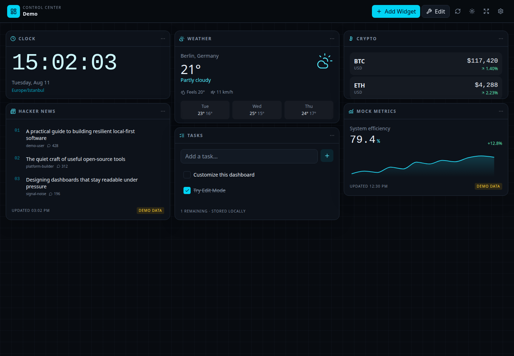

# Personal Information Control Center

An open-source, self-hosted dashboard platform for arranging the information that matters to you. Build multiple dashboards from draggable, resizable widgets; configure them entirely in the UI; and run the useful core without accounts or API keys.

> Status: MVP. The project name is intentionally descriptive while the platform matures.



## What is included

- Responsive 4–24-column dashboard grid with View, Edit, and fullscreen/TV modes
- Multiple dashboards, built-in templates, schema-driven widget settings, and JSON import/export
- Clock, Weather, Crypto, Hacker News, RSS, Tasks, and Mock Metrics widgets
- Demo Dashboard with deterministic data and Blank Dashboard for building from scratch
- Light, dark, and system themes with local browser persistence
- Registry-based widget and provider APIs for contributors
- Optional hardened RSS service; no general-purpose proxy
- Static frontend and Docker/VPS deployment paths

## Quick start

Requirements: Node.js 20.19+ (Node 22 recommended) and npm 10+.

```bash
git clone <repository-url>
cd personal-information-dashboard
npm install
cp .env.example .env
npm run dev
```

Open `http://localhost:5173`. The same command starts the Vite web app and the optional Hono API. Choose Demo Dashboard to explore the platform without external requests or choose any live template to use no-key providers.

Useful commands:

```bash
npm run typecheck
npm test
npm run build
npm run test:e2e
npm start
```

`npm start` serves the already-built API. In the Docker image, that server also serves the built web application.

## Configuration model

Dashboard configuration belongs in the UI: weather location, timezone, assets, feed URLs, refresh intervals, article counts, grid columns, theme, and layout are stored locally through a storage adapter. They do not belong in `.env`.

Environment variables are reserved for server infrastructure:

| Variable                    | Default                 | Purpose                            |
| --------------------------- | ----------------------- | ---------------------------------- |
| `PORT`                      | `3001`                  | Hono server port                   |
| `HOST`                      | `0.0.0.0`               | Bind address                       |
| `WEB_DIST_PATH`             | `../web/dist`           | Optional built frontend path       |
| `ALLOWED_ORIGINS`           | `http://localhost:5173` | Comma-separated API CORS origins   |
| `RSS_TIMEOUT_MS`            | `8000`                  | Remote feed timeout                |
| `RSS_MAX_BYTES`             | `2097152`               | Maximum feed response size         |
| `RSS_RATE_LIMIT_PER_MINUTE` | `30`                    | RSS requests per client per minute |

Never put a secret in a `VITE_*` variable: Vite exposes those values to browsers. V1 needs no provider credentials.

## Integrations

- **Open-Meteo:** browser-safe weather and geocoding without a key. The hosted free endpoint is intended for non-commercial use, is rate-limited, and requires attribution. Commercial deployments should configure a suitable future adapter or self-host the provider.
- **Coinbase:** browser-safe public crypto spot prices without a key.
- **Hacker News:** official public story API without a key.
- **RSS/Atom:** requires Server Mode because browsers cannot reliably or safely fetch arbitrary feeds.

Unavailable providers appear as “Coming Soon,” never as broken setup forms. See [integrations.md](docs/integrations.md).

## Deployment

Frontend-only deployments can publish `apps/web/dist` to a static host. Dashboard building, templates, Clock, Weather, Crypto, Hacker News, Tasks, and Mock Metrics work there; RSS clearly reports that Server Mode is needed.

For the complete deployment:

```bash
docker compose up -d --build
```

Open `http://localhost:3001`. The image contains a health check at `/api/health`. See [self-hosting.md](docs/self-hosting.md) for static hosting, Docker, reverse-proxy, and VPS guidance.

## Architecture and contribution

This repository uses npm workspaces:

```text
apps/web       React dashboard, widgets, providers, and local persistence
apps/api       Hono server and secure RSS normalization
packages/shared  Versioned persistence/export schemas and normalized DTOs
```

Read [architecture.md](docs/architecture.md) for data flow and security boundaries, and [creating-widgets.md](docs/creating-widgets.md) for the complete widget contribution workflow. General development and pull-request guidance is in [CONTRIBUTING.md](CONTRIBUTING.md).

## Security and privacy

- Dashboards are local to the current browser and are not uploaded by this project.
- Imports are schema-validated, added as new dashboards, and stripped of credential-shaped fields.
- The RSS service blocks local/private/reserved network targets, pins validated DNS, revalidates redirects, and enforces response/time/rate limits.
- Dashboard exports never include server environment variables.

Report vulnerabilities according to [SECURITY.md](SECURITY.md).

## Roadmap

Planned work includes storage adapters for accounts/sync, GitHub and calendar widgets, broader market/news providers, Markdown and iframe widgets, a constrained Custom API widget, additional translations, and expanded themes. Runtime execution of arbitrary third-party JavaScript is not planned for the current extension model.

## License

Licensed under the [Apache License 2.0](LICENSE).
